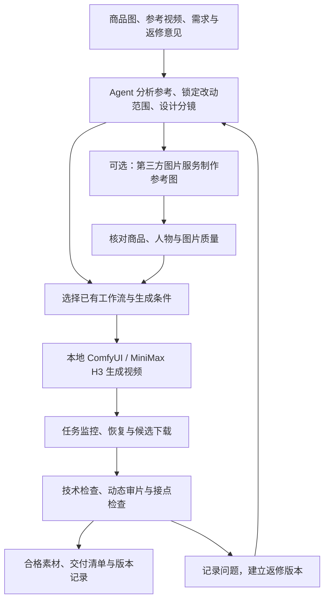

# H3 Ecommerce Director · 电商素材导演

**面向电商素材生成与参考复刻的 Agent Skill，以本地 MiniMax H3 / ComfyUI 为视频生成底座。**

从真实商品图、参考视频和制作需求出发，组织参考分析、人物与商品一致性控制、分镜、分层服务调用、生成、审片和返修，交付可复用的电商视频素材。适用于产品展示、人物口播、互动剧情、仅替换商品，以及有使用授权的参考复刻。

**已投入实际电商素材生产。维护者反馈：在实际使用中，1–2 分钟素材的整体生成质量很高。** 这一反馈来自维护者的生产实践；下文分别说明实际使用、公开代码验证和环境适配范围。1–2 分钟指整条素材的制作目标，制作过程按镜头与动作组织多段生成，随包构建器的单任务时长为 5–15 秒。

[下载发行版](https://github.com/xydzf520/h3-ecommerce-director/releases/latest) · [源自上游](https://github.com/TFboy1/oh-my-minimaxh3-director) · [详细差异](UPSTREAM.md) · [CI](https://github.com/xydzf520/h3-ecommerce-director/actions/workflows/tests.yml) · [MIT 许可](LICENSE)

## 为什么做这个版本

电商素材生产需要围绕具体商品和参考表达反复打磨：商品包装不能漂移，人物要像在真实交流，动作要保留原片的因果关系，长素材的前后段要接得上，返修还要能定位到具体版本。

本版将这些生产经验整理为可重复执行的 Skill 规范，并补充工作流、任务恢复、图片 API 和审片证据工具。核心改造包括：

- **围绕真实商品制作**：核对 SKU、包装、标识、结构、尺度、握持和遮挡后的身份一致性。
- **按参考表达复刻**：分析指定区间的事件、动作路径、说听关系和镜头用途，明确保留项与可改项。
- **让人物表演服务内容**：先设计交流对象、目的、情绪变化和反应，再写动作与对白。
- **组织 1–2 分钟素材生产**：区分镜头、生成任务和交付文件，检查跨段身份、动作、声音及清晰度。
- **分层使用本地与第三方能力**：本地 H3 负责视频，可选图片 API 辅助参考图制作；任务、服务和验收分别记录。
- **支持可追溯返修**：保存请求、参数、素材指纹、任务 ID、候选结果和审片证据，以新版本完成修正。

## 适合哪些场景

| 场景 | 本版关注的制作问题 |
|---|---|
| 商品展示、开箱、手部演示 | 包装和材质、商品尺度、手与物体接触、转动及遮挡过程 |
| 真人口播、采访、双人互动 | 说话人与听者归属、声音与口型、自然反应、商品融入 |
| 参考视频复刻与局部替换 | 指定参考区间、动作因果、镜头还原，以及“只换商品”等明确边界 |
| 投流创意改编 | 在允许修改的范围内调整角色、场景和表达，保留关键创意结构 |
| 1–2 分钟剧情或讲解素材 | 完整时间线、镜头覆盖、跨段动作与对白、人物及商品一致性 |
| 批量素材与定向返修 | 代表镜头试产、同类扩展、候选审片、受影响版本追踪 |

## 工作方式与分层调用



| 层次 | 职责 | 随包实现 |
|---|---|---|
| 制作决策 | 参考分析、商品与角色约束、分镜、表演、连续性和返修 | `SKILL.md` 与 `references/`，由 Agent 结合实际素材执行 |
| 视频生成 | 构建、提交、查询、恢复和下载 | 本地 ComfyUI HTTP API；支持用户显式配置远程 ComfyUI |
| 图片辅助 | 可选参考图生成、编辑与技术故障备用 | `gemini_image.py`，通过 ToAPIs 调用 Gemini 图片服务 |
| 质量与交付 | 完整解码、媒体规格、审片证据和成品身份核对 | 媒体/证据校验脚本，加实际观看与听查 |
| 外部集成 | ASR、业务表格、工作台、专用云视频或剪辑工具 | 按已有工具接入；本包未提供双 ASR、飞书、工作台后台、专用云视频和剪映部署 |

这里的分层由 Agent 按任务选择能力，配合各层脚本执行。本包没有统一的多供应商自动调度器或预算系统。视频默认在本地生成；使用远程 ComfyUI 或第三方图片服务时，相应提示词与参考素材会发送至服务方。

图片服务需由当前使用者选择并配置凭据。技术错误、鉴权/余额、审核拒绝、未知提交和画面质量问题分别处理；审核拒绝不自动跨供应商重试，结果未知时先查原任务。详见 [图片服务](references/image-fallback.md) 和 [工作流路由](references/workflow-routing.md)。

## 1–2 分钟素材如何制作

维护者已将这一流程用于实际生成，并反馈 1–2 分钟素材质量很高。长素材的制作重点是整条内容的组织、逐段质量和最终连续性，按以下流程执行：

1. **先理解完整表达。** 记录商品、准确文案、参考区间、人物关系、动作事件和交付用途，明确哪些内容保持、哪些允许改编。
2. **先设计镜头，再拆生成任务。** 根据叙事和剪辑需要决定切镜；同一完整动作或一句话不因脚本文件边界机械拆开。再按工作流能力安排生成段。
3. **先试关键镜头。** 用代表镜头验证商品、人物、动作和对白；结果合格后扩展同类镜头。
4. **检查相邻段。** 同镜头续接时核对实际首尾条件；有意切镜时核对动作、视线、空间和声音。依赖上一段尾帧的下一段，应在上一段质量通过后生成。
5. **保留固定高质量母版。** 每段对照原始人物与商品依据，避免反复用退化截图续生而逐段变糊。
6. **审完整时间线并定向返修。** 检查动作重复、角色重置、对白漏字/截尾、商品变形及清晰度；返修后重新检查相关接点。

随包构建器当前使用 5–15 秒单任务范围；内置 I2V 只接首帧。需要尾帧约束时必须使用真实支持该条件、且符合构建器输入约定的工作流。以上范围属于当前模板与工具，不能据此推断模型的全部能力。

默认交付需求约定的独立 MP4 和清单。完整成片、拼接预览及剪辑由需求和外部工具决定；本包未内置一键剪映拼合。制作细则见 [分镜决策](references/storyboard-editing.md)、[分段衔接](references/segment-continuity.md) 和 [清晰度检查](references/sharpness-quality.md)。

## 与原版相比，更新了什么

本项目派生自 [TFboy1/oh-my-minimaxh3-director](https://github.com/TFboy1/oh-my-minimaxh3-director)，以下对比固定于上游提交 [`9112661`](https://github.com/TFboy1/oh-my-minimaxh3-director/tree/911266137075a0b9fabf6268dc1c91ae05138ad9)。上游后续更新不在此对比范围内。

### 电商制作流程的增量

| 维度 | 原版基准 | 本版更新 |
|---|---|---|
| 项目定位 | 剧本到分镜、批量生成、剪映拼合的通用导演流水线 | 聚焦电商素材生成、参考复刻、商品替换和版本返修 |
| 制作输入 | 剧本、故事、角色参考和风格简报 | 增加真实 SKU、商品实图、参考指定区间、制作需求与审片反馈 |
| 商品一致性 | 通用参考图和生成条件 | 细化包装、文字标识、结构、比例、持握、受光和遮挡后的身份检查 |
| 参考还原 | 导演分镜、镜头设计和衔接要求 | 增加逐事件核对：动作起因、路径、接触、遮挡、道具来源、结果及反应 |
| 修改边界 | 按剧本与角色设定生成 | 区分复刻、局部替换、创意改编；“只换商品”时保留其他锁定维度 |
| 人物表达 | 已有 WenWu / hybrid 导演表达和表演提示词规范 | 面向口播与互动细化交流目的、说听关系、情绪变化、身体与声音配合 |
| 长素材组织 | 已有段级生成、镜头衔接和拼合设计 | 进一步区分镜头/job/交付素材；检查真实接点、状态延续和依赖段返修 |
| 清晰度 | 通用分辨率与生成参数 | 区分参考、原生输出、交付编码和网页预览；单独检查脸、眼睛及商品细节 |
| 节奏判断 | 含镜长统计与相应提示规则 | 平均镜长/标准差作为描述统计，质量结合实际事件、观看和剪辑用途判断 |
| 图片 API | 无本版新增的 ToAPIs 图片客户端 | 增加提交、查询、下载、凭据读取、输入/输出指纹和失败分类 |
| 审片与返修 | 以参数、生成状态、下载和拼合流程为主 | 增加参考、表演、对白、连续性、画质观察，以及证据与成品版本绑定 |
| 默认交付 | 剪映草稿与拼合流程 | 独立视频、交付清单和审片记录；完整拼接按实际需求另行组织 |
| 运行目标 | Windows 导向，含本地/云端、隧道和剪映引导 | Linux 本地 H3 生产；配置与业务数据分离，外部服务按需接入 |

**继承的基础能力保留上游归属：** H3 六段式提示词组织、Ref2VA / T2V / I2V 模板、工作流扫描、UI 转 API、构建器主体以及提交/监控初始设计来自上游。原版已经支持本地和远程 ComfyUI。本版没有修改 H3 模型权重，也未提供与原版同条件的量化画质基准；上述对比说明制作流程与工程实现的变化。

### 开源整理时补充的工程更新

| 更新 | 具体行为 |
|---|---|
| 条件图绑定修正 | 按首帧、尾帧和参考图的实际语义连线绑定；不支持的尾帧、多余参考和歧义槽位明确报错 |
| 提交与恢复 | 提交前保存任务身份及实际工作流快照；POST 超时不自动重发，先查队列/历史核对原任务 |
| 并发与版本保护 | 构建、提交和监控使用项目锁；已提交项目不可原地重建，返修建立新版本 |
| 生成/下载分离 | 下载失败仅重下，保留原任务 ID；保留多个视频输出及生成尝试记录 |
| 重试与 dry-run | 生成重试默认 0，设置 0 有效；dry-run 只检查本地输入，不探测服务或上传素材 |
| 可移植环境检查 | 去除历史批次依赖，按当前配置检查解释器、媒体工具和 ComfyUI 节点/模型 |
| 检查辅助工具 | 增加媒体完整解码、指定区间取帧、覆盖保护和审片证据身份校验 |
| 公开发行结构 | 清除私人主机、业务路径、客户标识和历史授权；补充公开配置、合成示例、依赖、测试和 CI |

原版的 Windows 剪映、自动关机、隧道和云实例开通工具未纳入本发行包；需要这些能力时可参考上游独立接入。完整来源记录见 [UPSTREAM.md](UPSTREAM.md)，首版整理记录见 [RELEASE_NOTES.md](RELEASE_NOTES.md)。

## 快速开始

### 1. 准备环境与安装

- Linux、Python 3.11+、`ffmpeg` / `ffprobe`。
- 支持读取 Skill 的 Agent；入口是 [SKILL.md](SKILL.md)。
- 实际生成另需已安装的 ComfyUI、兼容的 H3 节点与模型。模型权重不随包分发。
- 显存、速度与输出质量取决于模型量化、节点、分辨率、时长及素材复杂度。

```bash
git clone https://github.com/xydzf520/h3-ecommerce-director.git
cd h3-ecommerce-director
python3 -m venv .venv
source .venv/bin/activate
python -m pip install -r requirements.txt
python scripts/runtime_check.py --offline
```

也可以下载 [ZIP 发行包与 SHA256 校验文件](https://github.com/xydzf520/h3-ecommerce-director/releases/latest)。将项目目录放入使用中的 Agent 的 Skill 目录，或让 Agent 直接读取该目录的 `SKILL.md`；更新已有安装前先备份个人改动。

`requirements.txt` 用于可选图片客户端和联系表工具；ComfyUI 构建/提交/监控使用 Python 标准库及 Linux 文件锁。Skill 环境可以与 ComfyUI 推理环境分离。环境细则见 [本地配置](references/local-production.md)。

### 2. 运行离线样例

以下命令在仓库根目录执行，使用随包的无品牌陶瓷杯合成需求；仅构建工作流和检查输入，不生成视频、不调用第三方 API。

```bash
mkdir -p work/demo/.config
cp examples/pipeline-config.example.json work/demo/.config/pipeline-config.json
cp -r examples/minimal work/demo/cup-v1
python scripts/build_workflows.py --project work/demo/cup-v1 --workspace work/demo
python scripts/submit_jobs.py --project work/demo/cup-v1 --workspace work/demo --dry-run
```

样例为 T2V、5 秒、4 步、竖屏，用于跑通输入与构建流程。真实 SKU 保真任务应使用自己的商品参考和匹配工作流；样例参数不代表所有生产任务的质量推荐。

### 3. 连接本地 H3 并试产

确认本机 ComfyUI 已启动、H3 节点与模型匹配后执行：

```bash
python scripts/runtime_check.py --workspace work/demo --workflow work/demo/cup-v1/workflows/seg_01_api.json
python scripts/submit_jobs.py --project work/demo/cup-v1 --workspace work/demo
python scripts/monitor_jobs.py --project work/demo/cup-v1 --workspace work/demo --once
```

默认地址为 `http://127.0.0.1:8188`，可在工作区 `.config/pipeline-config.json` 修改地址、模板目录、轮询和重试参数。[公开配置样例](examples/pipeline-config.example.json) 不含密钥。

`--once` 仅查询一轮：未完成退出 1，可继续查询；需要处理的问题退出 2；全部下载完成退出 0，此时仍是待审候选。实际生产从代表镜头开始，按 [工作流路由](references/workflow-routing.md) 配置模板并处理恢复。

### 4. 按需启用图片服务

本地视频生成不要求配置图片 API。使用 ToAPIs Gemini 图片能力时，按 [图片服务说明](references/image-fallback.md) 配置 `TOAPIS_API_KEY`，或使用项目外的 `~/.config/toapis/api-key`，并限制文件访问权限。

凭据不写进 Skill、项目配置、请求快照、日志或交付包。第三方图片服务只承担图片任务，不自动改变视频后端。

## 给 Agent 的使用示例

**商品展示**

> 使用 $h3-ecommerce-director，根据这组商品实拍图制作竖屏展示素材。锁定包装、标识、颜色和真实比例，先试一个包含拿起、转动、放下的代表镜头，再扩展其他镜头。

**只替换商品**

> 复刻这段已获授权的参考视频，只替换为我提供的商品。保留人物、声音、服装、构图和关键动作；先分析指定区间，列出保留项和替换项，再生成并逐事件核对。

**1–2 分钟素材**

> 根据这份文案、商品图和参考片，制作约 90 秒的电商素材。先安排完整表达和镜头，再按工作流能力拆生成任务。保持人物、商品和声音一致，检查每个接点，交付按顺序编号的独立视频与清单。

**定向返修**

> 上一版第 3 段商品缩小了，第 4 段开头重复了拿起动作。保留其他已通过部分，定位相关生成任务和接点，新建返修版本并复核受影响的连续段。

输入准备：商品实图/准确 SKU、参考原片及指定区间、准确文案、保留与可改项、目标时长/画幅、交付形式。需要外部服务时同时明确可发送的素材范围。

## 质量验收与交付

| 检查项 | 检查内容 | 实施方式 |
|---|---|---|
| 技术可用性 | 完整解码、时长、流与音轨等媒体规格 | `check_media.py` |
| 商品与角色 | 包装、结构、比例、标识、人物身份及造型 | 对照真实参考并观看实际输出 |
| 参考与表演 | 动作因果、说听关系、情绪反应及自然度 | 按事件动态审片，保留观察证据 |
| 对白与声音 | 文字、说话人、漏字/重复、截尾、口型和听感 | 实际听查/观看，可接已有 ASR |
| 连续性与画质 | 相邻段动作、空间、声音、脸部与商品细节 | 检查实际接点及各段首/中/尾 |
| 版本与证据 | 审片是否对应当前文件、SHA 和任务 ID | 人物任务使用 `check_production_review.py` |

按实际文件路径执行，例如：

```bash
python scripts/check_media.py --input /path/to/project/materials/clip.mp4 --output /path/to/project/qa/technical-v1.json --require-audio
python scripts/check_production_review.py --review /path/to/project/production_review.json --manifest /path/to/project/delivery_manifest.json
```

无对白素材可省略 `--require-audio`。证据校验脚本验证结构和文件身份，画面与表演结论需要实际观察；缺少观察能力时保留 `needs_review`。生产检查通过和业务方最终审片分别记录。

交付包含约定的视频、顺序、时长、版本、SHA、任务来源和检查记录，注明原生分辨率及后期处理。返修保留旧版本；更新成品时同步更新证据。结构见 [交付约定](references/delivery-contract.md) 和 [清单样例](examples/delivery_manifest.example.json)。

## 目录与阅读顺序

```text
h3-ecommerce-director/
├── SKILL.md                 # Agent 入口与制作主流程
├── UPSTREAM.md              # 来源、基准提交和派生差异
├── assets/templates/        # T2V / Ref2VA / 首帧 I2V 模板
├── references/              # 电商制作、工作流、验收和可选集成规范
├── scripts/                 # 构建、提交、恢复、图片 API 和检查工具
├── examples/                # 公开配置、合成样例、交付与审片结构
├── tests/                   # 离线回归测试
└── FILE_SHA256.json         # 当前文件内容的校验清单，不包含自身
```

| 你要做什么 | 建议阅读 |
|---|---|
| 开始一个电商生产任务 | [Skill 入口](SKILL.md) · [制作约定](references/production-contract.md) |
| 复刻、仅换商品、调整角色 | [参考还原](references/reference-fidelity.md) · [角色与修改边界](references/paid-ad-character-design.md) |
| 改善人物口播和互动 | [自然表达](references/natural-expression.md) · [人物与商品融入](references/natural-performance.md) |
| 制作长素材或处理接点 | [分镜决策](references/storyboard-editing.md) · [分段衔接](references/segment-continuity.md) |
| 排查越来越模糊或身份漂移 | [清晰度检查](references/sharpness-quality.md) |
| 配环境、换工作流、恢复任务 | [本地配置](references/local-production.md) · [路由与恢复](references/workflow-routing.md) · [分镜格式](references/storyboard-schema.md) |
| 使用第三方图片服务 | [ToAPIs Gemini](references/image-fallback.md) |
| 审片和交付 | [交付与证据](references/delivery-contract.md) |
| 接入已有业务系统 | [飞书读取约定](references/feishu-cli.md) · [工作台同步约定](references/workbench-sync.md) |

## 实际使用、验证与当前边界

| 项目 | 当前情况 |
|---|---|
| 实际生产 | 维护者已投入实际电商素材生成；反馈 1–2 分钟素材整体质量很高 |
| 离线测试 | 首次开源验证时 34 项单元/回归/包结构测试通过 |
| 命令级检查 | 使用本地模拟 HTTP 服务和合成媒体完成 10 项检查，涵盖构建、提交、重复提交跳过、下载及验收阻断 |
| GitHub CI | 首版 Linux / Python 3.11、3.12、3.13、3.14 均通过；最新状态见 [Actions](https://github.com/xydzf520/h3-ecommerce-director/actions/workflows/tests.yml) |
| 画质反馈的范围 | 来自维护者实际使用，尚未提供统一公开样片集或与原版同条件的量化对照 |
| 开源整理验证的范围 | 整理过程中未重新执行真实 GPU 成片、付费图片 API 兼容性、第三方后台或 Windows 验证 |

生产实践与开源包整理测试是两种验证：前者反映实际素材效果，后者检查脚本行为与分发完整性。新环境需核对模型/节点与工作流，并通过代表镜头确定生产参数。

当前构建器适配每段一个 H3 生成节点及可解析的图片连线，复杂批处理/合图需额外适配。历史任务被服务端清理时，提交结果可能需要人工核对。双 ASR、专用云视频、工作台后台及剪映不属于随包已部署能力。

运行离线测试：

```bash
PYTHONPATH=scripts PYTHONDONTWRITEBYTECODE=1 python -m unittest discover -s tests -v
```

欢迎反馈工作流兼容性、商品一致性、长素材衔接和恢复问题。提交 Issue 时提供脱敏的环境/节点版本、命令、预期与实际行为；如附样片，请使用自有或允许公开的素材，不上传 API 密钥、客户原片或业务私密记录。

## 许可与致谢

本项目文档与脚本使用 [MIT 许可](LICENSE)，保留上游 TFboy1 的版权声明，并标注 xydzf520 的派生修改。感谢 [TFboy1/oh-my-minimaxh3-director](https://github.com/TFboy1/oh-my-minimaxh3-director) 提供导演流水线基础，更多来源见 [CONTRIBUTORS.md](CONTRIBUTORS.md)。

这是社区电商派生项目，不是 MiniMax 官方项目。H3 权重、ComfyUI、自定义节点和第三方服务分别遵循各自许可与条款；仓库 MIT 许可不覆盖模型权重、肖像、声音、商标或参考作品的使用权。
