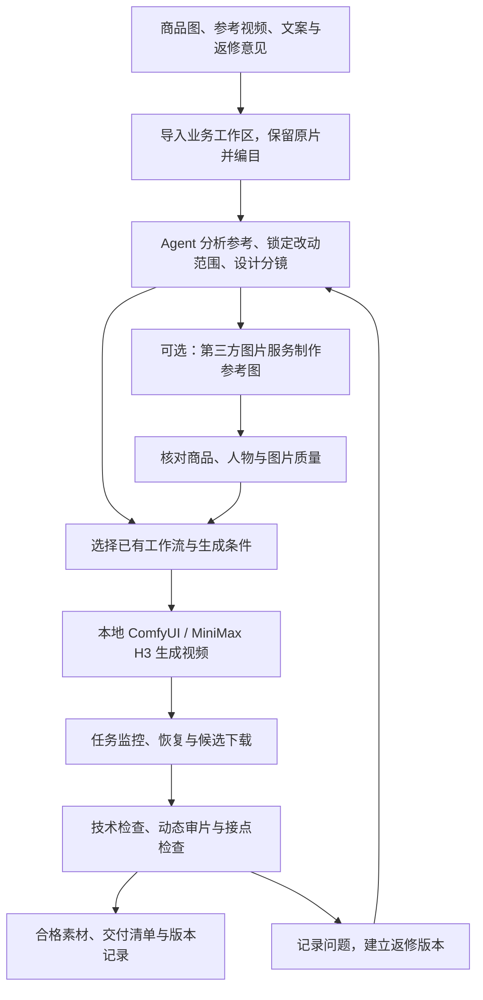

# H3 Ecommerce Director · 电商素材导演

**主要面向抖音电商投流的素材生成与参考复刻 Agent Skill，以本地 MiniMax H3 / ComfyUI 为视频生成底座。**

从真实商品图、参考视频和制作需求出发，组织参考分析、人物与商品一致性控制、分镜、分层服务调用、生成、审片和返修，服务需要持续迭代投流素材的商家、投手与创意制作团队。适用于抖音信息流广告中的产品展示、人物口播、互动剧情、仅替换商品，以及有使用授权的参考复刻。

**已投入实际电商素材生产。维护者反馈：在实际使用中，1–2 分钟素材的整体生成质量很高。** 这一反馈来自维护者的生产实践；下文分别说明实际使用、公开代码验证和环境适配范围。1–2 分钟指整条素材的制作目标，制作过程按镜头与动作组织多段生成，随包构建器的单任务时长为 5–15 秒。

[下载发行版](https://github.com/xydzf520/h3-ecommerce-director/releases/latest) · [源自上游](https://github.com/TFboy1/oh-my-minimaxh3-director) · [详细差异](UPSTREAM.md) · [CI](https://github.com/xydzf520/h3-ecommerce-director/actions/workflows/tests.yml) · [MIT 许可](LICENSE)

**首次使用：** 先看 [从资源导入到交付](#从资源导入到交付)，填写 [制作需求模板](examples/production-brief.example.md)，再让 Agent 按完整流程执行。重点能力见 [分段长视频优化](#核心难点分段长视频优化)。

## 为什么做这个版本

抖音投流素材生产需要围绕具体商品、卖点和参考表达反复打磨：商品包装不能漂移，人物要像在真实交流，动作要保留原片的因果关系，长素材的前后段要接得上，开场、讲解和场景的不同版本也要能分别试产与返修。

本版将这些生产经验整理为可重复执行的 Skill 规范，并补充工作流、任务恢复、图片 API 和审片证据工具。核心亮点是把素材、镜头、生成任务和验收连接成完整制作流程：

| 核心亮点 | 具体做法与价值 |
|---|---|
| **分段长视频的连续性控制** | 同镜头续接与有意切镜分别处理，追踪真实边界、动作状态、声音和后续依赖，面向 1–2 分钟素材组织生产 |
| **抑制逐段画质与身份退化** | 原片、清晰母版、剪辑尾帧各有职责；每段回到固定母版检查，失焦或变形的边界先修复再续段 |
| **商品身份与场景呈现分开验收** | 先核对 SKU/包装，再检查实际尺度、受光、持握和遮挡；转动、切近后仍需是同一商品 |
| **按事件还原参考** | 覆盖准备、触发、路径、接触、缓冲和结果；区分原片事实与改编设计，保留“只换商品”等指定范围 |
| **按交流目的设计人物** | 明确说话者、听者、获知信息和情绪变化；身份保持一致，表情随剧情发展，声音与身体配合 |
| **先验证最难的完整片段** | 代表试产覆盖高风险互动、产品操作或跨段接点，再扩展同类素材；出现重复问题时改变条件与方法 |
| **本地视频与图片辅助分层** | 默认本地 H3 视频，可选第三方图片服务；按实际工作流能力接入条件，记录输入、任务和结果 |
| **任务可恢复，返修可追溯** | 保存图与输入指纹，未知提交先核对，下载失败仅重下；返修建立新版本，审片证据绑定实际文件 |

## 从资源导入到交付

准备 **商品图 + 参考片及目标区间 + 文案/卖点 + 保留与可改项 + 时长和交付形式**，即可让 Agent 开始整理。已有角色图、声音参考和旧版本反馈可一起提供。

| 阶段 | 做什么 | 本阶段产物 |
|---|---|---|
| 1. 导入资源 | 复制原文件到业务工作区，分开商品、参考视频、角色和音频，记录来源、用途与 SHA | 原始资源目录、资源索引和 `brief.md` |
| 2. 理解需求与参考 | 定位实际参考区间，分析角色/对白、动作事件、商品依据，锁定保留与可改范围 | `plan.md` 中的需求、参考事件与改动范围 |
| 3. 建立母版与分镜 | 选择清晰身份/商品母版，先设计镜头与完整动作，再选择本地视频及可选图片路线 | 母版、镜头时间线、任务/交付映射与连续组 |
| 4. 代表镜头试产 | 先验证决定创意成立的难点，核对实际条件和输出 | 代表候选、审片观察及修正方案 |
| 5. 扩展生成与接续 | 独立任务按计划提交；依赖尾帧的段等待前段合格边界，再构建下一段 | 原生视频、任务 ID、边界帧与来源记录 |
| 6. 整体审片与精剪 | 检查商品、表演、对白、原生细节和真实接点，按需求制作完整预览 | 技术检查、动态观察、精剪片段与审片证据 |
| 7. 反馈返修 | 定位问题版本和时间点，修受影响镜头，复核相关上下游接点 | 新版本与变更记录、更新后的预览/证据 |
| 8. 交付复用 | 按需求输出独立视频或完整成片，注明顺序、时长、规格、来源和状态 | MP4、交付清单、SHA 与审片记录 |

**可以直接交给 Agent：**

> 使用 $h3-ecommerce-director，按 `references/business-workflow.md` 完成这条抖音投流素材。商品图在【路径】，参考视频在【路径】，使用【起止时间】；准确文案和保留/可改项见【需求文件】，目标【时长、画幅和交付形式】。先复制并编目资源，保留原片，分析参考和制作范围；准备母版、镜头及任务映射，先试最难的完整片段。代表片通过后在本轮约定范围内继续生成。分段时检查实际边界、商品、声音和清晰度，返修追踪受影响接点，最后交付视频与清单。视频使用本地 H3；需要新增外部图片服务时先说明所需资源与用途。

资源导入由 Agent/制作者整理文件；制作决策、动态审片与精剪使用当前可用工具。脚本负责工作流和任务执行，未捆绑一键导入界面或剪辑器。目录示例、资源复制、分段项目组织、运行命令和故障恢复见 **[完整业务流程指南](references/business-workflow.md)**。

## 核心难点：分段长视频优化

维护者已用于 1–2 分钟素材生产，并反馈整体质量很高。Skill 针对长素材中容易累积的问题提供了细化流程：人物与商品漂移、每段重新开场、动作重复、对白错位、越接越糊，以及返修后接点再次失效。

### 先分清镜头、生成任务与交付文件

观众看到的一个连续镜头可能需要多个生成任务；一个任务也可能包含多个镜头。Skill 先按叙事和动作决定是否切镜，再按模型条件拆任务，最后按业务用途决定交付文件。对白覆盖表和视觉事件表共同检查内容是否完整，生成时长与最终采用时长分别记录。

同机位的未完成动作按真实边界续接；中景切手部特写、反打或听者反应则按动作阶段、空间和声音匹配。这样既保留必要的细节镜头，也能减少机械分段带来的等待、重复动作和停顿。

### 分段制作中的十项重点优化

下表是现有 Skill 中的制作与验收策略，由 Agent 配合实际工作流执行；其中的条件绑定和证据身份检查有随包脚本支持。

| 难点 | Skill 中的处理方法 | 核心依据 |
|---|---|---|
| **前后段空间跳变** | 锁定前段最终裁切点，取对应原生尾帧作为后段首帧条件；同时核对左右位置、视线、手势、道具、光线与动作阶段 | [分段衔接](references/segment-continuity.md) |
| **首尾写进计划却未生效** | 检查实际节点连线，分别绑定首帧、尾帧和身份参考；不支持的条件直接报错 | [工作流路由](references/workflow-routing.md) |
| **越接越糊、人物变样** | 固定高质量母版保持身份与细节；尾帧只承担边界职责，眼睛变软、脸型漂移或商品损坏时停止继续传递 | [清晰度检查](references/sharpness-quality.md) |
| **每段重复拿取、入场或开场** | 记录连续组和事件状态：商品已取出、角色已走近、手已接触，下一段承接现状；接点覆盖前段最后及后段最初的完整动作 | [分段衔接](references/segment-continuity.md) |
| **商品缩小、变扁或换包装** | 对照真实 SKU、盒体长宽厚度及相对手掌比例，检查转动、遮挡和单/双手转换；识别冲突参考带回旧包装的问题 | [商品与动作还原](references/reference-fidelity.md) |
| **声音换人、听者跟读或对白截断** | 角色表绑定外形与声音来源，镜头标明说话/倾听/画外音；跨镜声音保留来源与采用区间，复核重复、漏字、句尾和响度 | [制作约定](references/production-contract.md) |
| **为求稳定而全程僵硬** | 身份与剧情状态分开；尾帧使用合理动作落点，普通独立镜头不默认同图首尾，反应发生在信息或接触触发之后 | [自然表演](references/natural-performance.md) |
| **单段都正常，合起来变速或拖沓** | 分别诊断播放时间映射、生成动作速度和剪辑停留，正常速度检查实际接点前后；按完整表达精剪与补镜 | [自然表达](references/natural-expression.md) |
| **帧率相同仍出现拼接问题** | 核对像素格式、色彩、时间基和音频，从各自原生结果处理交付片，检查全片解码与首/中/末内容 | [分段编码与检查](references/segment-continuity.md) |
| **修前一段导致后续再次失效** | 记录边界来源、裁切映射和文件 SHA；前段重做或改变剪辑终点后重查下游依赖，新成品绑定新审片证据 | [交付与版本](references/delivery-contract.md) |

**例如“拿起商品 → 转动展示 → 回答问题”分成三个任务：** 第一段先通过抓取和商品检查，再用最终采用的原生尾帧启动第二段；第二段保留同一商品、握持与尺度，转动后检查包装和清晰度；第三段延续持物及人物状态，让反应对应问题。若改了第二段的采用终点，就重新核对第三段的起始边界和声音，而不是只替换中间文件。

### 当前哪些已由代码执行

| 环节 | 当前实现 |
|---|---|
| 条件接入 | `build_workflows.py` 按语义绑定图片输入，拒绝丢弃尾帧、参考数量错误和共享槽位歧义 |
| 任务稳定性 | 项目锁、请求快照、输入指纹、未知提交核对、下载独立恢复及多输出保留 |
| 检查辅助 | 指定区间取帧、完整解码，以及审片记录与当前文件/任务/完整预览的身份校验 |
| 长片制作决策 | 分镜、精确裁切与边界提取、动态审片、声音时间线和依赖返修由 Agent/制作者配合外部工具完成；尚无自动依赖调度或自动画质判定 |

随包构建器单任务时长为 5–15 秒，内置 I2V 只有首帧。需要尾帧约束时选择实际支持的自定义图。**依赖前段输出的下一段要在条件齐备后构建；已提交项目不能原地重建，因此按阶段建立独立可执行项目并在同一制作计划中关联。** 具体操作见 [长素材分段流程](references/business-workflow.md#6-按依赖扩展分段长视频)。

## 适合哪些抖音投流场景

本版尤其适合围绕明确商品、可核实卖点和可见使用场景制作内容，并需要持续产出不同创意版本的任务。可先从下面的素材类型选择代表镜头试产。

| 场景 | 本版关注的制作问题 |
|---|---|
| 商品展示、开箱、手部演示 | 包装和材质、商品尺度、手与物体接触、转动及遮挡过程 |
| 真人口播、采访、双人互动 | 说话人与听者归属、声音与口型、自然反应、商品融入 |
| 参考视频复刻与局部替换 | 指定参考区间、动作因果、镜头还原，以及“只换商品”等明确边界 |
| 投流创意改编 | 在允许修改的范围内调整角色、场景和表达，保留关键创意结构 |
| 1–2 分钟剧情或讲解素材 | 完整时间线、镜头覆盖、跨段动作与对白、人物及商品一致性 |
| 批量素材与定向返修 | 代表镜头试产、同类扩展、候选审片、受影响版本追踪 |

### 更适合优先尝试的行业

以下按行业常见的商品表达形式与本 Skill 的能力匹配整理，供选题和试产使用。具体是否好用，取决于商品结构、参考质量和所需动作的复杂度。

| 行业 | 可优先制作的投流素材 | 与本版能力的匹配点 |
|---|---|---|
| 美妆个护 | 商品展示、包装开箱、护理场景、人物口播与质地介绍 | 商品母版、人物近景和自然表达可共同组织，重点核对包装、肤质与手部细节 |
| 家居百货、日用清洁 | 收纳、厨房/卫浴场景、手持展示、使用步骤讲解 | 商品与生活场景结合，适合按接触、取放、遮挡和动作结果逐项检查 |
| 食品饮料 | 包装展示、开箱、餐桌场景、人物介绍与分享剧情 | 适合组合包装身份、场景氛围和说听关系，核对实物外观与数量 |
| 服饰配饰、箱包 | 穿搭展示、配饰近景、出行场景和人物讲解 | 可围绕固定角色制作不同景别与场景，重点核对版型、材质、图案和商品比例 |
| 数码配件、小家电 | 外观展示、手持讲解、桌面场景和简单操作演示 | 可结合产品近景与口播，按真实结构检查接口、按键及操作过程 |
| 宠物用品 | 包装/用品展示、居家摆放、尺寸介绍和主人口播 | 可从清晰商品与生活场景切入，先验证尺寸、材质及商品身份 |

选题时优先考虑：商品外观依据清楚、卖点能被画面或准确讲解表达、人物和商品关系明确、交互过程可以逐段核对。精密结构、复杂手部操作或多人多物体连续互动，应先试最关键的镜头，再决定是否扩展整条素材。

### 在投流素材迭代中怎么用

1. **锁定商品和已确认卖点。** 先明确受众、使用场景、文案和参考用途，再设计开场、讲解与商品展示；沿用参考创意时逐项记录保留和修改范围。
2. **围绕一个创意做可比较的版本。** 根据当前需求分别调整开场表达、人物/场景、讲解顺序或商品景别，保持其他已确认条件，便于识别差异并定向返修。
3. **把版本带入实际投放复盘。** 交付素材编号、文案、改动项和检查记录，由投放团队结合真实反馈决定下一轮。素材画面质量与投放效果分别评估，点击、转化和 ROI 需以实际投放数据为依据。

1–2 分钟是维护者已有实际生成反馈的素材长度；具体时长按创意、信息量和投放方案确定。本 Skill 负责素材制作与交付，广告账户配置、计划投放和数据回收使用现有投放工具完成。

## 工作方式与分层调用



| 层次 | 职责 | 随包实现 |
|---|---|---|
| 制作决策 | 参考分析、商品与角色约束、分镜、表演、连续性和返修 | `SKILL.md` 与 `references/`，由 Agent 结合实际素材执行 |
| 视频生成 | 构建、提交、查询、恢复和下载 | 本地 ComfyUI HTTP API；支持用户显式配置远程 ComfyUI |
| 图片辅助 | 可选参考图生成、编辑与技术故障备用 | `gemini_image.py`，通过 ToAPIs 调用 Gemini 图片服务 |
| 质量与交付 | 完整解码、媒体规格、审片证据和成品身份核对 | 媒体/证据校验脚本，加实际观看与听查 |
| 外部集成 | ASR、业务表格、工作台、专用云视频或剪辑工具 | 按已有工具接入；本包未提供双 ASR、飞书、工作台后台、专用云视频和剪映部署 |

这里的分层由 Agent 按任务选择能力，配合各层脚本执行。本包没有统一的多供应商自动调度器或预算系统。视频默认在本地生成；使用远程 ComfyUI 或第三方图片服务时，相应提示词与参考素材会发送至服务方。

图片服务需由当前使用者选择并配置凭据。技术错误、鉴权/余额、审核拒绝、未知提交和画面质量问题分别处理；审核拒绝不自动跨供应商重试，结果未知时先查原任务。详见 [图片服务](references/image-fallback.md) 和 [工作流路由](references/workflow-routing.md)。

## 与原版相比，更新了什么

本项目派生自 [TFboy1/oh-my-minimaxh3-director](https://github.com/TFboy1/oh-my-minimaxh3-director)，以下对比固定于上游提交 [`9112661`](https://github.com/TFboy1/oh-my-minimaxh3-director/tree/911266137075a0b9fabf6268dc1c91ae05138ad9)。上游后续更新不在此对比范围内。

### 电商制作流程的增量

| 维度 | 原版基准 | 本版更新 |
|---|---|---|
| 项目定位 | 剧本到分镜、批量生成、剪映拼合的通用导演流水线 | 聚焦抖音电商投流素材、参考复刻、商品替换和版本返修 |
| 制作输入 | 剧本、故事、角色参考和风格简报 | 增加真实 SKU、商品实图、参考指定区间、制作需求与审片反馈 |
| 商品一致性 | 通用参考图和生成条件 | 细化包装、文字标识、结构、比例、持握、受光和遮挡后的身份检查 |
| 参考还原 | 导演分镜、镜头设计和衔接要求 | 增加逐事件核对：动作起因、路径、接触、遮挡、道具来源、结果及反应 |
| 修改边界 | 按剧本与角色设定生成 | 区分复刻、局部替换、创意改编；“只换商品”时保留其他锁定维度 |
| 人物表达 | 已有 WenWu / hybrid 导演表达和表演提示词规范 | 面向口播与互动细化交流目的、说听关系、情绪变化、身体与声音配合 |
| 长素材组织 | 已有段级生成、镜头衔接和拼合设计 | 增加最终裁切边界、三类参考分工、事件状态延续、跨段商品/声音/画质检查与依赖返修，详见上方十项优化 |
| 清晰度 | 通用分辨率与生成参数 | 区分参考、原生输出、交付编码和网页预览；单独检查脸、眼睛及商品细节 |
| 节奏判断 | 含镜长统计与相应提示规则 | 平均镜长/标准差作为描述统计，质量结合实际事件、观看和剪辑用途判断 |
| 图片 API | 无本版新增的 ToAPIs 图片客户端 | 增加提交、查询、下载、凭据读取、输入/输出指纹和失败分类 |
| 审片与返修 | 以参数、生成状态、下载和拼合流程为主 | 增加参考、表演、对白、连续性、画质观察，以及证据与成品版本绑定 |
| 默认交付 | 剪映草稿与拼合流程 | 独立视频、交付清单和审片记录；完整拼接按实际需求另行组织 |
| 运行目标 | Windows 导向，含本地/云端、隧道和剪映引导 | Linux 本地 H3 生产；配置与业务数据分离，外部服务按需接入 |

**继承的基础能力保留上游归属：** H3 六段式提示词组织、Ref2VA / T2V / I2V 模板、工作流扫描、UI 转 API、构建器主体以及提交/监控初始设计来自上游。原版已经支持本地和远程 ComfyUI。本版没有修改 H3 模型权重，也未提供与原版同条件的量化画质基准；上述对比说明制作流程与工程实现的变化。

### 开源整理时补充的工程更新

| 更新 | 具体行为 |
|---|---|
| 条件图绑定修正 | 按首帧、尾帧和参考图的实际语义连线绑定；不支持的尾帧、多余参考和歧义槽位明确报错 |
| 提交与恢复 | 提交前保存任务身份及实际工作流快照；POST 超时不自动重发，先查队列/历史核对原任务 |
| 并发与版本保护 | 构建、提交和监控使用项目锁；已提交项目不可原地重建，返修建立新版本 |
| 生成/下载分离 | 下载失败仅重下，保留原任务 ID；保留多个视频输出及生成尝试记录 |
| 重试与 dry-run | 生成重试默认 0，设置 0 有效；dry-run 只检查本地输入，不探测服务或上传素材 |
| 可移植环境检查 | 去除历史批次依赖，按当前配置检查解释器、媒体工具和 ComfyUI 节点/模型 |
| 检查辅助工具 | 增加媒体完整解码、指定区间取帧、覆盖保护和审片证据身份校验 |
| 公开发行结构 | 清除私人主机、业务路径、客户标识和历史授权；补充公开配置、合成示例、依赖、测试和 CI |

原版的 Windows 剪映、自动关机、隧道和云实例开通工具未纳入本发行包；需要这些能力时可参考上游独立接入。完整来源记录见 [UPSTREAM.md](UPSTREAM.md)，首版整理记录见 [RELEASE_NOTES.md](RELEASE_NOTES.md)。

## 快速开始

### 1. 准备环境与安装

- Linux、Python 3.11+、`ffmpeg` / `ffprobe`。
- 支持读取 Skill 的 Agent；入口是 [SKILL.md](SKILL.md)。
- 实际生成另需已安装的 ComfyUI、兼容的 H3 节点与模型。模型权重不随包分发。
- 显存、速度与输出质量取决于模型量化、节点、分辨率、时长及素材复杂度。

```bash
git clone https://github.com/xydzf520/h3-ecommerce-director.git
cd h3-ecommerce-director
python3 -m venv .venv
source .venv/bin/activate
python -m pip install -r requirements.txt
python scripts/runtime_check.py --offline
```

也可以下载 [ZIP 发行包与 SHA256 校验文件](https://github.com/xydzf520/h3-ecommerce-director/releases/latest)。将项目目录放入使用中的 Agent 的 Skill 目录，或让 Agent 直接读取该目录的 `SKILL.md`；更新已有安装前先备份个人改动。

`requirements.txt` 用于可选图片客户端和联系表工具；ComfyUI 构建/提交/监控使用 Python 标准库及 Linux 文件锁。Skill 环境可以与 ComfyUI 推理环境分离。环境细则见 [本地配置](references/local-production.md)。

### 2. 运行离线样例

以下命令在仓库根目录执行，使用随包的无品牌陶瓷杯合成需求；仅构建工作流和检查输入，不生成视频、不调用第三方 API。

```bash
mkdir -p work/demo/.config
cp examples/pipeline-config.example.json work/demo/.config/pipeline-config.json
cp -r examples/minimal work/demo/cup-v1
python scripts/build_workflows.py --project work/demo/cup-v1 --workspace work/demo
python scripts/submit_jobs.py --project work/demo/cup-v1 --workspace work/demo --dry-run
```

样例为 T2V、5 秒、4 步、竖屏，用于跑通输入与构建流程。真实 SKU 保真任务应使用自己的商品参考和匹配工作流；样例参数不代表所有生产任务的质量推荐。

### 3. 连接本地 H3 并试产

确认本机 ComfyUI 已启动、H3 节点与模型匹配后执行：

```bash
python scripts/runtime_check.py --workspace work/demo --workflow work/demo/cup-v1/workflows/seg_01_api.json
python scripts/submit_jobs.py --project work/demo/cup-v1 --workspace work/demo
python scripts/monitor_jobs.py --project work/demo/cup-v1 --workspace work/demo --once
```

默认地址为 `http://127.0.0.1:8188`，可在工作区 `.config/pipeline-config.json` 修改地址、模板目录、轮询和重试参数。[公开配置样例](examples/pipeline-config.example.json) 不含密钥。

`--once` 仅查询一轮：未完成退出 1，可继续查询；需要处理的问题退出 2；全部下载完成退出 0，此时仍是待审候选。实际生产从代表镜头开始，按 [工作流路由](references/workflow-routing.md) 配置模板并处理恢复。

### 4. 按需启用图片服务

本地视频生成不要求配置图片 API。使用 ToAPIs Gemini 图片能力时，按 [图片服务说明](references/image-fallback.md) 配置 `TOAPIS_API_KEY`，或使用项目外的 `~/.config/toapis/api-key`，并限制文件访问权限。

凭据不写进 Skill、项目配置、请求快照、日志或交付包。第三方图片服务只承担图片任务，不自动改变视频后端。

## 给 Agent 的使用示例

**商品展示**

> 使用 $h3-ecommerce-director，根据这组商品实拍图制作竖屏展示素材。锁定包装、标识、颜色和真实比例，先试一个包含拿起、转动、放下的代表镜头，再扩展其他镜头。

**只替换商品**

> 复刻这段已获授权的参考视频，只替换为我提供的商品。保留人物、声音、服装、构图和关键动作；先分析指定区间，列出保留项和替换项，再生成并逐事件核对。

**1–2 分钟素材**

> 根据这份文案、商品图和参考片，制作约 90 秒的抖音电商投流素材。围绕已确认卖点安排完整表达和镜头，再按工作流能力拆生成任务。保持人物、商品和声音一致，检查每个接点，交付按顺序编号的独立视频与清单。

**定向返修**

> 上一版第 3 段商品缩小了，第 4 段开头重复了拿起动作。保留其他已通过部分，定位相关生成任务和接点，新建返修版本并复核受影响的连续段。

输入准备：商品实图/准确 SKU、参考原片及指定区间、准确文案、保留与可改项、目标时长/画幅、交付形式。需要外部服务时同时明确可发送的素材范围。

## 质量验收与交付

| 检查项 | 检查内容 | 实施方式 |
|---|---|---|
| 技术可用性 | 完整解码、时长、流与音轨等媒体规格 | `check_media.py` |
| 商品与角色 | 包装、结构、比例、标识、人物身份及造型 | 对照真实参考并观看实际输出 |
| 参考与表演 | 动作因果、说听关系、情绪反应及自然度 | 按事件动态审片，保留观察证据 |
| 对白与声音 | 文字、说话人、漏字/重复、截尾、口型和听感 | 实际听查/观看，可接已有 ASR |
| 连续性与画质 | 相邻段动作、空间、声音、脸部与商品细节 | 检查实际接点及各段首/中/尾 |
| 版本与证据 | 审片是否对应当前文件、SHA 和任务 ID | 人物任务使用 `check_production_review.py` |

按实际文件路径执行，例如：

```bash
python scripts/check_media.py --input /path/to/project/materials/clip.mp4 --output /path/to/project/qa/technical-v1.json --require-audio
python scripts/check_production_review.py --review /path/to/project/production_review.json --manifest /path/to/project/delivery_manifest.json
```

无对白素材可省略 `--require-audio`。证据校验脚本验证结构和文件身份，画面与表演结论需要实际观察；缺少观察能力时保留 `needs_review`。生产检查通过和业务方最终审片分别记录。

交付包含约定的视频、顺序、时长、版本、SHA、任务来源和检查记录，注明原生分辨率及后期处理。返修保留旧版本；更新成品时同步更新证据。结构见 [交付约定](references/delivery-contract.md) 和 [清单样例](examples/delivery_manifest.example.json)。

## 目录与阅读顺序

```text
h3-ecommerce-director/
├── SKILL.md                 # Agent 入口与制作主流程
├── UPSTREAM.md              # 来源、基准提交和派生差异
├── assets/templates/        # T2V / Ref2VA / 首帧 I2V 模板
├── references/              # 电商制作、工作流、验收和可选集成规范
├── scripts/                 # 构建、提交、恢复、图片 API 和检查工具
├── examples/                # 制作需求模板、公开配置、合成样例、交付与审片结构
├── tests/                   # 离线回归测试
└── FILE_SHA256.json         # 当前文件内容的校验清单，不包含自身
```

| 你要做什么 | 建议阅读 |
|---|---|
| 第一次用，从资源导入跑到交付 | [完整业务流程](references/business-workflow.md) · [制作需求模板](examples/production-brief.example.md) |
| 开始一个电商生产任务 | [Skill 入口](SKILL.md) · [制作约定](references/production-contract.md) |
| 复刻、仅换商品、调整角色 | [参考还原](references/reference-fidelity.md) · [角色与修改边界](references/paid-ad-character-design.md) |
| 改善人物口播和互动 | [自然表达](references/natural-expression.md) · [人物与商品融入](references/natural-performance.md) |
| 制作长素材或处理接点 | [分镜决策](references/storyboard-editing.md) · [分段衔接](references/segment-continuity.md) |
| 排查越来越模糊或身份漂移 | [清晰度检查](references/sharpness-quality.md) |
| 配环境、换工作流、恢复任务 | [本地配置](references/local-production.md) · [路由与恢复](references/workflow-routing.md) · [分镜格式](references/storyboard-schema.md) |
| 使用第三方图片服务 | [ToAPIs Gemini](references/image-fallback.md) |
| 审片和交付 | [交付与证据](references/delivery-contract.md) |
| 接入已有业务系统 | [飞书读取约定](references/feishu-cli.md) · [工作台同步约定](references/workbench-sync.md) |

## 实际使用、验证与当前边界

| 项目 | 当前情况 |
|---|---|
| 实际生产 | 维护者已投入实际电商素材生成；反馈 1–2 分钟素材整体质量很高 |
| 离线测试 | 首次开源验证时 34 项单元/回归/包结构测试通过 |
| 命令级检查 | 使用本地模拟 HTTP 服务和合成媒体完成 10 项检查，涵盖构建、提交、重复提交跳过、下载及验收阻断 |
| GitHub CI | 首版 Linux / Python 3.11、3.12、3.13、3.14 均通过；最新状态见 [Actions](https://github.com/xydzf520/h3-ecommerce-director/actions/workflows/tests.yml) |
| 画质反馈的范围 | 来自维护者实际使用，尚未提供统一公开样片集或与原版同条件的量化对照 |
| 开源整理验证的范围 | 整理过程中未重新执行真实 GPU 成片、付费图片 API 兼容性、第三方后台或 Windows 验证 |

生产实践与开源包整理测试是两种验证：前者反映实际素材效果，后者检查脚本行为与分发完整性。新环境需核对模型/节点与工作流，并通过代表镜头确定生产参数。

当前构建器适配每段一个 H3 生成节点及可解析的图片连线，复杂批处理/合图需额外适配。历史任务被服务端清理时，提交结果可能需要人工核对。双 ASR、专用云视频、工作台后台及剪映不属于随包已部署能力。

运行离线测试：

```bash
PYTHONPATH=scripts PYTHONDONTWRITEBYTECODE=1 python -m unittest discover -s tests -v
```

欢迎反馈工作流兼容性、商品一致性、长素材衔接和恢复问题。提交 Issue 时提供脱敏的环境/节点版本、命令、预期与实际行为；如附样片，请使用自有或允许公开的素材，不上传 API 密钥、客户原片或业务私密记录。

## 许可与致谢

本项目文档与脚本使用 [MIT 许可](LICENSE)，保留上游 TFboy1 的版权声明，并标注 xydzf520 的派生修改。感谢 [TFboy1/oh-my-minimaxh3-director](https://github.com/TFboy1/oh-my-minimaxh3-director) 提供导演流水线基础，更多来源见 [CONTRIBUTORS.md](CONTRIBUTORS.md)。

这是社区电商派生项目，不是 MiniMax 官方项目。H3 权重、ComfyUI、自定义节点和第三方服务分别遵循各自许可与条款；仓库 MIT 许可不覆盖模型权重、肖像、声音、商标或参考作品的使用权。
